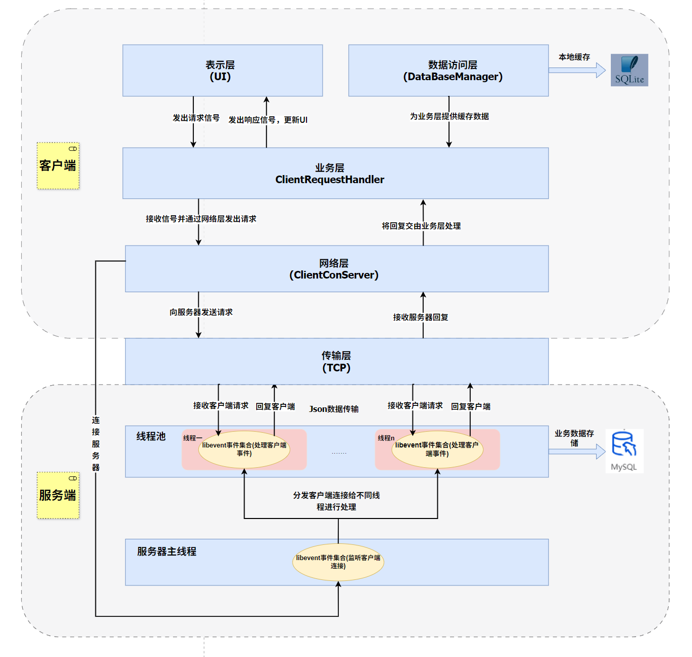

# 💬 Chat-libevent - 基于 libevent 的即时聊天系统

一个高性能、跨平台的实时聊天系统，采用 C++ 服务器 + Qt 客户端的架构，支持即时通讯、群组聊天、文件传输等功能。

---

## 📋 目录

- [项目简介](#🎯-项目简介)
- [功能特性](#✨-功能特性)
- [技术架构](#🏗️-技术架构)
- [快速开始](#🚀-快速开始)
- [服务器文档](#📡-服务器文档)
- [客户端文档](#💻-客户端文档)
- [常见问题](#❓-常见问题)
- [贡献指南](#🤝-贡献指南)

---

## 🎯 项目简介

Chat-libevent 是一个完整的聊天解决方案，包含两个主要组件：

- **📡 chatServer**: 基于 libevent 的高性能 C++ 服务器
- **💻 chatClient**: 基于 Qt6 的现代化桌面客户端

系统采用经典的 C/S 架构，支持多客户端并发连接，提供稳定可靠的即时通讯服务。

---

## ✨ 功能特性

### 🔐 用户系统

- ✅ 用户注册与登录
- ✅ 密码验证与安全
- ✅ 用户信息管理
- ✅ 在线状态显示

### 💬 聊天功能
- ✅ 私聊消息
- ✅ 群组聊天
- ✅ 文本消息
- ✅ 图片传输（支持压缩）
- ✅ 文件传输（大文件分块）
- ✅ 富文本消息
- ✅ 消息历史记录

### 👥 社交功能

- ✅ 好友管理
- ✅ 好友分组
- ✅ 创建群组
- ✅ 群成员管理
- ✅ 联系人列表

### 🎨 客户端特性

- ✅ 现代化 UI 设计
- ✅ 消息气泡显示
- ✅ 表情选择器
- ✅ 截图功能
- ✅ 拖拽上传
- ✅ 自动重连
- ✅ 本地缓存（SQLite）
- ✅ 实时消息通知

### 🤖 AI 助手（可选）

- ✅ 集成 DeepSeek API
- ✅ 智能对话
- ✅ AI 聊天页面

---

## 🏗️ 技术架构

### 系统架构图



### 服务器端 (chatServer)

```
┌─────────────────────────────────────────┐
│              Chat Server                │
├─────────────────────────────────────────┤
│  📡 Network Layer (libevent)            │
│  - Reactor 模式                         │
│  - 事件驱动 I/O                         │
│  - 多线程线程池                         │
├─────────────────────────────────────────┤
│  🔄 Business Logic Layer                │
│  - 用户认证                             │
│  - 消息路由                             │
│  - 群组管理                             │
├─────────────────────────────────────────┤
│  💾 Data Access Layer                   │
│  - MySQL 数据库                         │
│  - Snowflake ID 生成                    │
│  - 内存缓存                             │
├─────────────────────────────────────────┤
│  📝 Utils                               │
│  - 日志系统                             │
│  - 事件工具                             │
└─────────────────────────────────────────┘
```

**核心技术栈**:

- **网络库**: libevent (Reactor 模式)
- **数据库**: MySQL
- **序列化**: JsonCpp
- **编程语言**: C++17
- **并发模型**: 线程池 + 事件驱动
- **ID 生成**: Snowflake 算法

### 客户端 (chatClient)

```
┌─────────────────────────────────────────┐
│           Chat Client (Qt)              │
├─────────────────────────────────────────┤
│  🎨 UI Layer (Qt Widgets)               │
│  - 主窗口框架                           │
│  - 页面管理                             │
│  - 自定义组件                           │
├─────────────────────────────────────────┤
│  🔄 Business Logic Layer                │
│  - 网络请求处理                         │
│  - 数据管理                             │
│  - 页面逻辑                             │
├─────────────────────────────────────────┤
│  💾 Data Access Layer                   │
│  - SQLite 本地数据库                    │
│  - DAO 设计模式                         │
│  - 两级缓存机制                         │
├─────────────────────────────────────────┤
│  🌐 Network Layer                       │
│  - TCP Socket                           │
│  - 异步通信                             │
│  - 自动重连                             │
├─────────────────────────────────────────┤
│  📝 Utils                               │
│  - 日志工具                             │
│  - 时间工具                             │
│  - 文件工具                             │
└─────────────────────────────────────────┘
```

**核心技术栈**:

- **GUI 框架**: Qt 6.5+
- **构建系统**: CMake 3.19+
- **UI 组件**: ElaWidgetTools
- **本地数据库**: SQLite
- **网络通信**: Qt Network
- **编程语言**: C++17

---


---

## 🚀 快速开始

### 环境要求

**服务器端**:
- C++17 或更高版本
- CMake 3.19+
- MySQL 5.7+
- libevent 2.1+
- JsonCpp

**客户端**:
- Qt 6.5+
- CMake 3.19+
- C++17 编译器
  - Windows: MSVC 2022 / MinGW
  - Linux: GCC 9+ / Clang 10+

### 编译指南

#### 1. 克隆项目

```bash
git clone https://github.com/yourusername/Chat-libevent.git
cd Chat-libevent
```

#### 2. 编译服务器端

```bash
cd chatServer
mkdir build && cd build

# 配置 CMake
cmake .. -DCMAKE_BUILD_TYPE=Release

# 编译
cmake --build .

# 运行服务器
./chatServer
```

#### 3. 编译客户端

```bash
cd ../chatClient
mkdir build && cd build

# 配置 CMake（指定 Qt 路径）
cmake .. -DCMAKE_PREFIX_PATH=/path/to/qt -DCMAKE_BUILD_TYPE=Release

# 编译
cmake --build .

# 运行客户端
./chatClient
```

### 数据库配置

服务器启动前需要配置 MySQL 数据库：

```sql
-- 创建数据库
CREATE DATABASE chat_system;

-- 创建用户表（服务器会自动创建）
-- 创建群组表（服务器会自动创建）
```

服务器首次启动时会自动创建所需的数据库表。

---

## 📡 服务器文档

### 核心组件

#### ChatServer (服务器核心)

- **位置**: `header/chat_server.h`, `src/chat_server.cpp`
- **职责**: 管理服务器生命周期、启动监听、分发连接

#### ChatThread (线程池)

- **位置**: `header/chat_thread.h`, `src/chat_thread.cpp`
- **职责**: 处理客户端请求、事件循环
- **配置**: 默认 3 个线程

#### DataBase (数据库操作)
- **位置**: `header/data_base.h`, `src/data_base.cpp`
- **职责**: MySQL 数据库读写、用户认证

#### ChatInfo (在线用户管理)
- **位置**: `header/chat_info.h`, `src/chat_info.cpp`
- **职责**: 维护在线用户列表、群组信息

#### SnowflakeIDGenerator (ID 生成器)

- **位置**: `header/snowflake_id_generator.h`, `src/snowflake_id_generator.cpp`
- **职责**: 生成唯一 ID（UID/GID）

### 线程模型

```
┌─────────────┐
│ 主线程      │  监听连接
└──────┬──────┘
       │
       ├────────────────┬────────────────┐
       │                │                │
   ┌───▼───┐        ┌───▼───┐        ┌───▼───┐
   │线程1  │        │线程2  │        │线程3  │
   │事件循环│        │事件循环│        │事件循环│
   └───┬───┘        └───┬───┘        └───┬───┘
       │                │                │
   处理客户端A       处理客户端B       处理客户端C
```

### 性能优化

1. **线程池**: 固定 3 个工作线程，避免频繁创建/销毁
2. **事件驱动**: libevent 实现高并发 I/O
3. **内存缓存**: ChatInfo 缓存在线用户，减少数据库查询
4. **读写锁**: 使用 `std::shared_mutex` 提高并发读性能

---

## 💻 客户端文档

### 页面架构

```
MainWindow (主窗口)
├── MenuBar (菜单栏)
├── ElaNavigation (导航栏)
│   ├── MessagePage (消息页)
│   ├── ContactPage (联系人页)
│   ├── UserPage (用户页)
│   └── AboutPage (关于页)
└── ContentArea (内容区)
    ├── ConversationPage (聊天页)
    │   ├── Conversation聊天)
    │   └── ConversationGroupPage (FriendPage (好友群组聊天)
    └── LLMPage (AI 聊天页，可选)
```

### 数据库设计

**本地 SQLite 数据库表**:

```sql
-- 用户信息表
user_info (
    ssid INTEGER PRIMARY KEY,
    username TEXT,
    avatar_path TEXT
)

-- 好友关系表
friendship (
    id INTEGER PRIMARY KEY,
    ssid INTEGER,
    friend_ssid INTEGER,
    grouping_name TEXT,
    friend_name TEXT,
    status TEXT,
    friend_type INTEGER
)

-- 群组信息表
group_info (
    ssid_group INTEGER PRIMARY KEY,
    group_name TEXT,
    avatar_path TEXT,
    create_ssid INTEGER
)

-- 群成员表
group_member (
    id INTEGER PRIMARY KEY,
    ssid_group INTEGER,
    ssid_member INTEGER
)
```

### 网络请求处理

```
ClientRequestHandler (请求处理器)
├── 查询用户信息 (queryUserInfoByUid)
├── 批量查询 (queryUserInfoBatch)
├── 查询群组信息 (queryGroupInfoByGid)
├── 图片处理 (image_private_chunk)
└── 模糊搜索 (queryFuzzySearchRequest)
```

**特性**:
- 异步请求处理
- 超时管理（5 秒）
- 自动重试机制
- 回调函数通知

---


---

## ❓ 常见问题

### Q: 服务器启动失败？
**A**: 检查以下几点：
1. MySQL 数据库是否运行
2. 数据库用户权限是否正确
3. 端口 8888 是否被占用
4. 防火墙是否允许该端口

### Q: 客户端无法连接服务器？
**A**: 检查以下几点：
1. 服务器 IP 和端口是否正确
2. 客户端和服务器是否在同一网络
3. 服务器是否正常运行
4. 防火墙设置

### Q: 如何修改服务器端口？
**A**: 编辑 `chatServer/src/main.cpp` 文件，找到：
```cpp
server.listen("0.0.0.0", 8888);
```
将 8888 改为你需要的端口。

### Q: 如何修改客户端连接地址？

**A**: 编辑 `chatClient/src/utils/net-work/clientconserver.h` 文件，找到：
```cpp
#define IP "192.168.200.130"
#define PORT 8888
```

### Q: 数据库连接失败？
**A**: 确保：

1. MySQL 服务正在运行
2. 用户名和密码正确
3. 数据库 `chat_system` 已创建
4. 用户有足够权限

---

## 🤝 贡献指南

我们欢迎所有形式的贡献！

### 贡献方式

1. **Fork** 本项目
2. 创建特性分支 (`git checkout -b feature/AmazingFeature`)
3. 提交更改 (`git commit -m 'Add some AmazingFeature'`)
4. 推送到分支 (`git push origin feature/AmazingFeature`)
5. 创建 **Pull Request**

### 待办事项

- [ ] 支持消息撤回
- [ ] 支持语音消息
- [ ] 支持视频通话
- [ ] 支持消息加密
- [ ] 支持群管理员功能
- [ ] 添加单元测试
- [ ] 性能监控面板
- [ ] 支持 Docker 部署

---

## 📄 许可证

本项目基于 [MIT](LICENSE) 许可证开源。

---

## 👨‍💻 开发者

- **开发者**：所说咋咋2035
- **联系方式：**QQ-2035797167

---

## 🙏 致谢

感谢以下开源项目：

- [libevent](https://libevent.org/) - 高性能网络库
- [Qt](https://www.qt.io/) - 跨平台应用框架
- [JsonCpp](https://github.com/open-source-parsers/jsoncpp) - JSON 解析库
- [ElaWidgetTools](https://github.com/) - Qt UI 组件库

---

⭐ **如果这个项目对你有帮助，请给我们一个 Star！** ⭐
